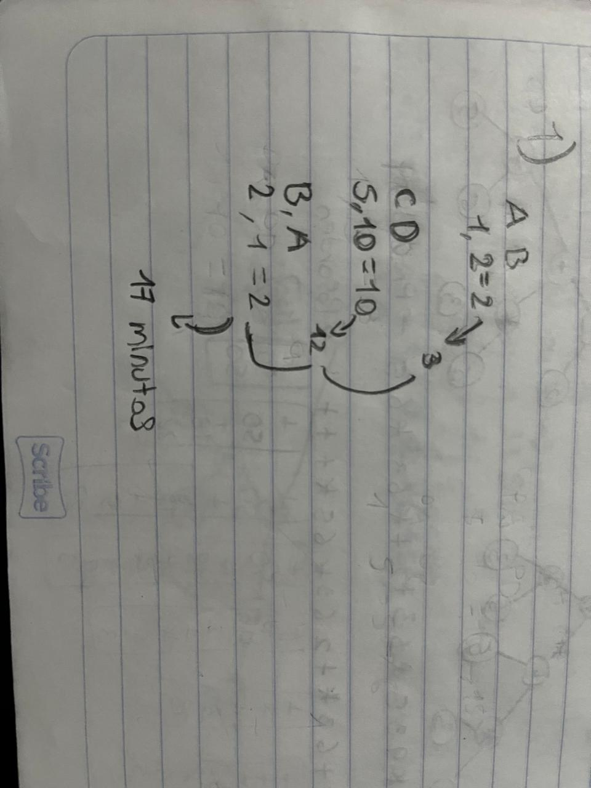
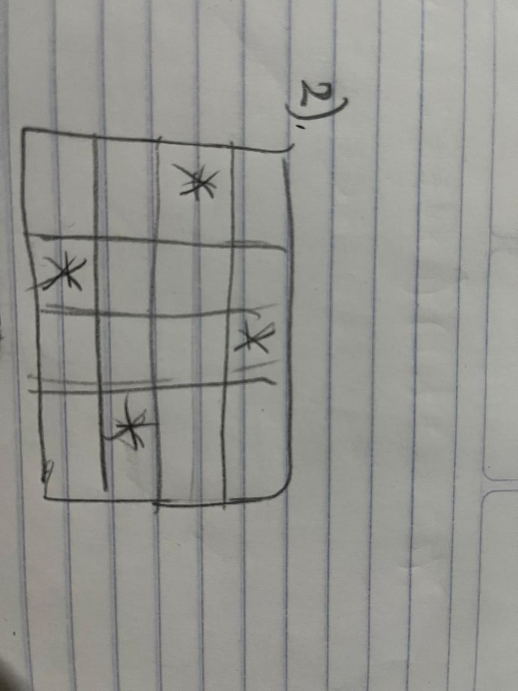
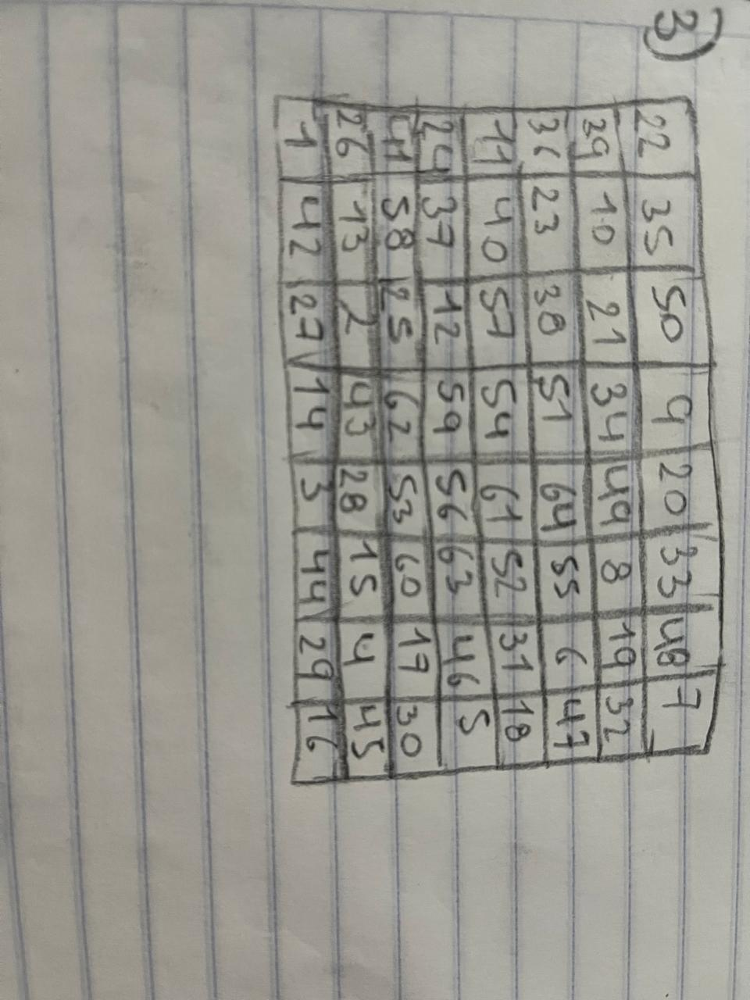

> ### Problemas de lógica
### Ejercicio 1

4 personas deben cruzar el puente de noche pero el problema es que solo tiene un linterna, el puente solo soporta dos personas a la vez y cuándos dos cruzan juntos deben moverse a la velocidad del mas lento, cada persona tiene una velocidad de cruce diferente, persona A en un minutos, persona B en dos minutos, persona C en 5 minutos y la persona D en 10 minutos

* No pueden cruzar sin la linterna 
* Solo dos personas a la vez
* El tiempo total es de la persona mas lenta que cruza 
* Deben encontrar la forma mas rápida de cruzar
* Todos deben cruzar el puente en menos de 17 minutos
* Cual es la estrategia para encontrar la mejor solución posible 
* Cuantos viajes se necesitan 
* Se puede hacer un programa en Clisp con la mejor solución 

A y B cruzan juntos en 2 minutos. A regresa con la linterna y pasan 3 minutos. C y D cruzan juntos en 10 minutos y pasan 13 minutos. B regresa con la linterna por A y pasan 15 minutos. Por ultimo A y B cruzan juntos nuevamente en 2 minutos y pasan los 17 minutos.


---
### Ejercicio 2
Colocar 4 reinas en un tablero de ajedrez de 4x4 de manera que ninguna se ataque entre sí. Es decir, ninguna reina puede estar en la misma fila, columna o diagonal que otra reina.


---
### Ejercicio 3
Mover un caballito por todo un tablero de ajedrez de 8x8 de manera que pase por todos los 64 puntos del tablero exactamente una vez.



> ### Enunciados de programación lógica 
### Obtener:

* Propiedad y relaciones
* Constante individual y variable individual
* Cuantificador existencial y universal
* Dominio del discurso

1.- La Tierra es un planeta.
* Constante individual, propiedad planeta Planeta(tierra) p(t)

2.- La Luna no es un planeta. 
* Constante individual Luna no tiene la propiedad de ser planeta ¬Planeta(Luna)

3.- La Luna es un satélite. 
* Constante individual Luna propiedad es ser satélite Satélite(Luna)

4.- La Tierra gira alrededor del Sol.
* Constante individual Tierra y Sol Gira(Tierra, Sol)

5.- Todo planeta es un satélite.
* Axp(X)^s(X)
 
6.- Todo planeta gira alrededor del Sol.
* Axg(X,S)

7.- Algún planeta gira alrededor de la Luna.
* Exg(X,L)

8.- Hay por lo menos un satélite.
* Exs(X)

9.- Todos los perros del vecindario muerden a algún cartero.

* Axp(X)->E(y)^m(X,Y)

10.- Hay un cartero al que lo muerden todos los perros.
* Ey(Ax(p(X)->m(X,Y)))

11.- Todos los carteros son mordidos por algún perro.
* Ay(c(Y)->Ex(p(X)^m(X,Y)))

12.- Hay un perro que muerde a todos los carteros.
* Ex(p(X)^Ay(c(Y)->m(X,Y)))

13.- Todos los perros que asustan a algún cartero, lo muerden.
* Ax((p(X)^Ey(c(Y)^a(X,Y)))->Ez(m(X,Z)))

14.- Hay un perro que muerde a todos los perros que muerden a algún cartero.
* Ex(p(X)^Ay((p(Y)^Ez(c(Z)^m(Y,Z)))->m(X,Y)))

15.- Hay un solo perro que se muerde a si mismo.
* Ex(p(X)^m(X,X)^Ay(p(Y)^m(Y,Y)->Y=X))

> ### Ejemplo usando SWIPROLOG
```Prolog 
auto(mustang).
auto(chevy).
padre(juan).
padre(jose).
madre(elena).
madre(luisa).
madre(tere).

padrede(jose, juan).
padrede(juan, pedro).
padrede(sergio, antonio).
padrede(martin, alfonso).
padrede(juan, maria).
padrede(arturo, julia).
madrede(julia, martin).
madrede(elena, antonio).

abuelo(X,Y):-padrede(X,Z), padrede(Z,Y); madrede(X,Z), madrede(Z,Y).
```
> ### Mi árbol genealógico usando SWIPROLOG
```Prolog
padre(juan).
padre(trinidad).
madre(elena).
madre(ramona).

esposa(rosa, enrique).
esposa(gricelda, martin).
padrede(trinidad, martin).
padrede(trinidad, enrique).
padrede(juan, gricelda).
padrede(martin, adolfo).
padrede(martin, diego).
padrede(martin, tadeo).
padrede(enrique, moises).
padrede(enrique, israel).
padrede(enrique, ariana).
madrede(ramona, martin).
madrede(ramona, enrique).
madrede(elena, gricelda).
madrede(gricelda, adolfo).
madrede(gricelda, diego).
madrede(gricelda, tadeo).
madrede(rosa, moises).
madrede(rosa, israel).
madrede(rosa, ariana).

hombre(juan).
hombre(trinidad).
hombre(martin).
hombre(enrique).
hombre(adolfo).
hombre(diego).
hombre(tadeo).
hombre(moises).
hombre(israel).

mujer(elena).
mujer(ramona).
mujer(gricelda).
mujer(rosa).
mujer(ariana).

abuelo(X, Y) :-(padrede(X, Z); madrede(X, Z)), (padrede(Z, Y); madrede(Z, Y)).

hermano(X, Y):-(padrede(Z, X), padrede(Z, Y)); (madrede(W, X), madrede(W, Y)), X \= Y.

tio(X, Y)    :- (hermano(X, Z)), (padrede(Z, Y); madrede(Z, Y)), X \=Z.

primo(X, Y)  :- (padrede(Z, X); madrede(Z, X)), (padrede(W, Y); madrede(W, Y)), hermano(Z, W), X \= Y, Z \=W.

nieto(X, Y)  :- (padrede(Z, X); madrede(Z, X)), (padrede(Y, Z); madrede(Y, Z)).

sobrino(X, Y):- (padrede(Z, X); madrede(Z, X)), hermano(Z, Y), Z \=Y. 

cunada(X, Y) :- esposa(X, Z), hermano(Z, Y), Z \=Y.
```