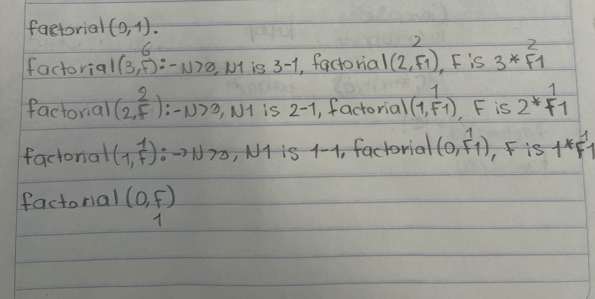
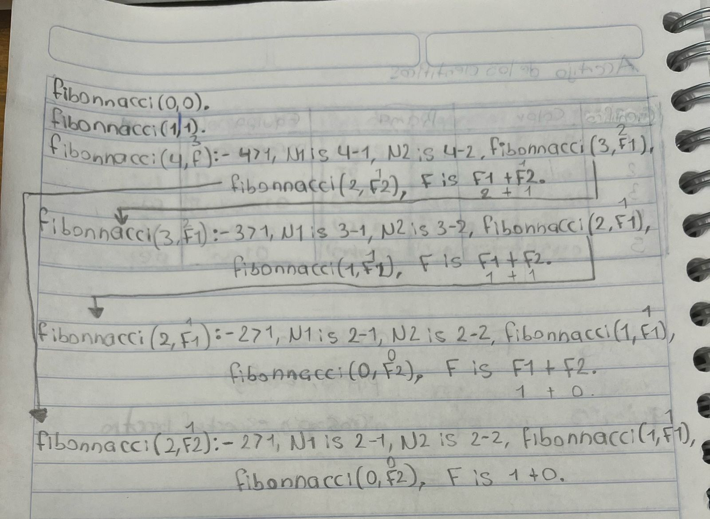
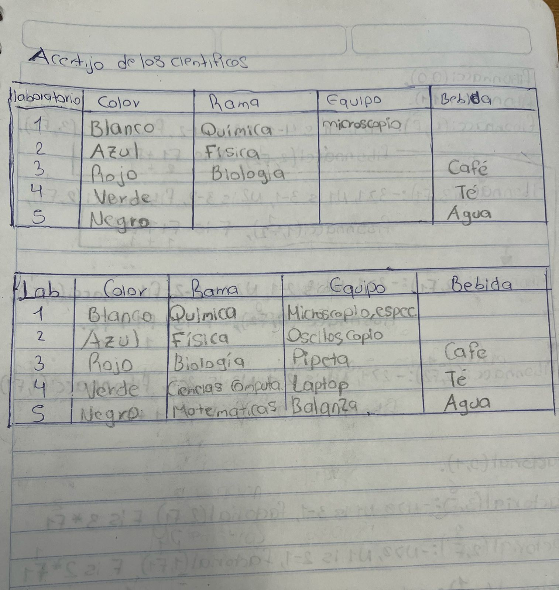

> ### Problemas de programación Lógica 
**Problema 1: Los guardianes de los templos.**

Cuatro guardianes (Apolo, Hécate, Ares y Hermes) custodian templos mitológicos asociados con diferentes elementos (fuego, agua, tierra y aire). Sabemos que:

- Apolo no cuida el templo de fuego ni el de tierra.
- Hécate no cuida el templo de aire.
- Ares no cuida el templo de agua ni de aire.
- Hermes cuida el templo de fuego o de agua.

Pregunta: ¿Qué templo cuida cada guardián?
```Prolog
templo(aire).
templo(tierra).
templo(fuego).
templo(agua).
guardian(apolo).
guardian(hecate).
guardian(ares).
guardian(hermes).

cuida(apolo, aire).
cuida(hecate, tierra).
cuida(ares, fuego).
cuida(hermes, agua).
no_cuida(apolo, fuego, tierra).
no_cuida(hecate, aire, _).
no_cuida(ares, agua, aire).

% Ejemplo de consulta: cuida(X, Y).
```
**Problemas 2: Las armas de los héroes Cuatro héroes mitológicos.**

Las armas de los héroes Cuatro héroes mitológicos (Aquiles, Perseo, Hércules y Teseo) poseen armas únicas (espada, lanza, arco y escudo). Sabemos que: 

- Aquiles no usa el escudo ni el arco. 
- Perseo no usa la espada. 
- Hércules no usa la lanza ni el escudo. 
- Teseo usa el arco o el escudo. 

Pregunta: ¿Qué arma pertenece a cada héroe?
```Prolog
heroe(aquiles).
heroe(perseo).
heroe(hercules).
heroe(teseo).
arma(espada).
arma(lanza).
arma(arco).
arma(escudo).

usa(aquiles, lanza).
usa(perseo, escudo).
usa(hercules, espada).
usa(teseo, arco).
no_usa(aquiles, escudo, arco).
no_usa(perseo, espada, _).
no_usa(hercules, lanza, escudo).

% Ejemplo de consulta: usa(X,Y).
```
**Problema 3: Las gemas de los titanes Cuatro titanes.**

(Cronos, Océano, Hiperión y Japeto) tienen cada uno una gema (zafiro, rubí, esmeralda y diamante). Sabemos que:

- Cronos no tiene el zafiro ni el diamante. 
- Océano no tiene el rubí. 
- Hiperión no tiene el zafiro ni el rubí. 
- Japeto tiene el diamante o la esmeralda. 

Pregunta: ¿Qué gema tiene cada titán?
```Prolog
titan(cronos).
titan(oceano).
titan(hiperion).
titan(japeto).
gema(zafiro).
gema(rubi).
gema(esmeralda).
gema(diamante).

tiene(cronos, rubi).
tiene(oceano, zafiro).
tiene(hiperion, esmeralda).
tiene(japeto, diamante).
no_tiene(cronos, zafiro, diamante).
no_tiene(oceano, rubi, _).
no_tiene(hiperion, zafiro, rubi).

% Ejemplo de consulta: tiene(X,Y).
```

>### Factorial y Fibonnacci usando la unificación 

```Prolog
factorial(0, 1). 
factorial(N, F) :-  
    N > 0,  
    N1 is N - 1,  
    factorial(N1, F1),  
    F is N * F1.  


fibonnacci(0, 0). 
fibonnacci(1, 1).
fibonnacci(N, F):- 
    N > 1, 
    N1 is N - 1, 
    N2 is N -2, 
    fibonnacci(N1, F1), fibonnacci(N2, F2), 
    F is F1 + F2.
```

>### Prueba de escritorio
#### Factorial 

---
#### Fibonnacci

---
>### Acertijo de los Científicos y sus Laboratorios.

Cinco científicos trabajan en un centro de investigación. Cada uno tiene un laboratorio en un color diferente y se especializa en una rama distinta de la ciencia. Además, cada científico usa un tipo diferente de equipo y prefiere una bebida específica mientras trabaja.

Pistas:

- El científico en el laboratorio rojo investiga en Biología.  
- El físico trabaja en el laboratorio azul.  
- El químico usa un microscopio.
- La persona en el laboratorio verde toma té.  
- El laboratorio verde está a la derecha del laboratorio blanco.  
- El científico que usa un espectrofotómetro investiga en Química. 
- El investigador del laboratorio amarillo usa una centrífuga.
- El científico en el laboratorio del centro toma café.  
- El investigador del laboratorio naranja trabaja en
Matemáticas.  
- El científico en el primer laboratorio usa un microscopio.
- El científico que usa una pipeta trabaja junto al que investiga en Física.  
- El científico que usa una balanza trabaja junto al que usa un
espectrofotómetro.  
- El investigador que trabaja en Ciencias de la
Computación usa una laptop.  
- Uno de los científicos usa un osciloscopio.
- El científico en el laboratorio negro bebe agua.  

Preguntas a responder con Prolog 
* ¿En qué laboratorio trabaja el científico de Química? En el laboratorio verde 
* ¿Quién usa la pipeta? El científico en el laboratorio 3 (rojo) que investiga en Biología.  
* ¿Cuál es la bebida preferida del científico que investiga en Matemáticas? Agua 


