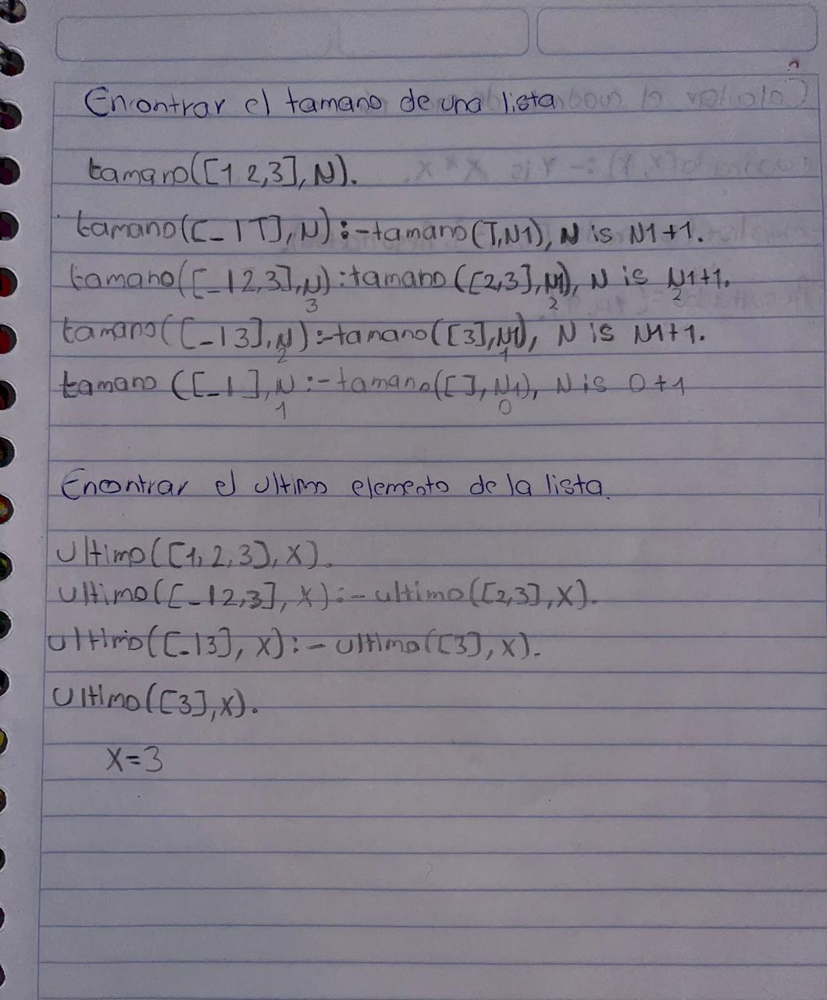

> ### Problemas con Predicados Mitológicos
1. Aplanar una lista de listas anidadas

* Utiliza el predicado flatten para transformar una estructura anidada en una lista plana.
* Problema: Dada una lista como [1, [2, [3, 4], 5], [6]], genera [1, 2, 3, 4, 5, 6].
* Predicado: `flatten/2`.

```Prolog
% Convierte una lista con estructuras anidadas en una lista plana.
flatten([], []).
flatten([H|T], R) :-
    flatten(H, RH),
    flatten(T, RT),
    append(RH, RT, R).
flatten(X, [X]) :-
    X \= [],
    X \= [_|_].

% Ejemplo: Aplanar una lista.

% ?- flatten([1, [2, [3, 4], 5],[6]], R).
% R = [1, 2, 3, 4, 5, 6].
```

2. Encontrar todas las permutaciones de una lista

* Utiliza *permutacion*` para generar todas las permutaciones posibles de una lista.
* Problema: Dada la lista [a, b, c], genera las permutaciones:
    - [a, b, c]
    - [a, c, b]
    - [b, a, c]
    - [b, c, a]
    - [c, a, b]
    - [c, b, a]

* Predicado: `permutacion/2`.

```Prolog
permutacion([], []).
permutacion([H|T], P) :-
    permutacion(T, R),
    insertar(H, R, P).

insertar(X, L, [X|L]).
insertar(X, [H|T], [H|R]) :- insertar(X, T, R).

% Ejemplo: Enumerar las permutaciones de una lista.
% ?- permutacion([a, b, c], P).
% P = [a, b, c];
% P = [a, c, b];
% P = [b, a, c];
% ...
```

3. Generar subconjuntos de una lista
* Utiliza subconjunto para encontrar todos los subconjuntos posibles de una lista.
* Problema: Dada la lista [1, 2, 3], genera:
    - []
    - [1]
    - [2]
    - [3]
    - [1, 2]
    - [1, 3]
    - [2, 3]
    - [1, 2, 3]
* Predicado: subconjunto.
```Prolog
subconjunto([], []).
subconjunto([H|T], [H|R]) :-
    subconjunto(T, R).
subconjunto([_|T], R) :-
    subconjunto(T, R).

% Ejemplo: Generar subconjuntos.
% ?- subconjunto([1, 2, 3], S).
% S = [];
% S = [1];
% S = [2];
% S = [1, 2];
% ...
```

4. Encontrar todos los números en un rango que cumplen una condición
* Usa findall para encontrar números que cumplan una propiedad específica, como ser pares o primos.
* Problema: Encuentra todos los números primos entre 1 y 20.
* Predicados: findall, es\primo.
```Prolog

es_primo(N) :-
    N > 1,
    N1 is N - 1,
    \+ (between(2, N1, K), N mod K =:= 0).

% Encuentra todos los primos entre 1 y 20
% ?- findall(Primo, (between(1, 20, Primo), es_primo(Primo)), Primos).
% Resultado esperado:
% Primos = [2, 3, 5, 7, 11, 13, 17, 19].
```

5. Concatenar dos listas
* Usa append para combinar dos listas en una sola.
* Problema: Combina `[1, 2]` y `[3, 4]` en `[1, 2, 3, 4]`.
* Predicado: append.
```Prolog
append([], L, L).
append([H|T], L, [H|R]) :-
    append(T, L, R).

% Ejemplo 1: Concatenar listas.
% ?- append([1, 2], [3, 4], Resultado).
% Resultado = [1, 2, 3, 4].
```

6. Encontrar elementos únicos en una lista
* Usa findall y member para eliminar duplicados.
* Problema: Dada la lista [1, 2, 2, 3, 3, 3, 4], genera [1, 2, 3, 4].
* Predicados: findall, member.
```Prolog
eliminar_duplicados(Lista, SinDuplicados) :-
    eliminar_duplicados_aux(Lista, [], SinDuplicados).

eliminar_duplicados_aux([], _, []).
eliminar_duplicados_aux([H|T], Vistos, Resultado) :-
    ( member(H, Vistos) ->
        eliminar_duplicados_aux(T, Vistos, Resultado)
    ;
        findall(H, \+ member(H, Vistos), [H]),  % usamos findall, aunque solo devuelve H si no está en Vistos
        eliminar_duplicados_aux(T, [H|Vistos], Resto),
        Resultado = [H|Resto]
    ).

% Ejemplo de uso:
% ?- eliminar_duplicados([1,2,2,3,3,3,4], R).
% R = [1, 2, 3, 4].

```

7. Calcular la potencia de un número
* Usa un predicado recursivo y `findall/3` para calcular todas las potencias de un número hasta un límite.
* Problema: Dado el número 2, calcula sus potencias hasta 2^5: [1, 2, 4, 8, 16, 32]
* Predicado: findall.
```Prolog
calcular_potencias(Base, MaxExp, Potencias) :-
    findall(Potencia, (between(0, MaxExp, Exp), Potencia is Base ** Exp), Potencias).

% Ejemplo de uso: 
% ?- calcular_potencias(2, 5, Potencias).
% Potencias = [1, 2, 4, 8, 16, 32].
```

8. Alinear equipos en un torneo
* Usa *permutacion* para generar todas las alineaciones posibles de equipos en un torneo.
* Problema: Dado un conjunto de equipos [A, B, C], genera todas las combinaciones posibles de enfrentamientos.
* Predicado: permutacion
```Prolog
permutaciones([], []).
permutaciones([H|T], P) :-
    permutaciones(T, R),
    inserta(H, R, P).

inserta(X, L, [X|L]).
inserta(X, [H|T], [H|R]) :- inserta(X, T, R).

% Ejemplo: Enumerar las permutaciones de una lista.
% ?- permutaciones([A, B, C], P).
% P = [A, B, C];
% P = [A, C, B];
% P = [B, A, C];
% ...
```


9. Resolver problemas de caminos
* Encuentra todas las rutas posibles entre dos nodos en un grafo utilizando `findall/3`.
* Problema: Dado un grafo representado como:
    - arco(a, b).
    - arco(b, c).
    - arco(c, d).
    - arco(a, d).
* Encuentra todas las rutas de a a d.
* Predicados: findall, predicado recursivo para buscar caminos.
```Prolog
arco(a, b).
arco(b, c).
arco(c, d).
arco(a, d).

camino(Inicio, Fin, Camino) :-
    camino_rec(Inicio, Fin, [Inicio], Camino).

camino_rec(Fin, Fin, CaminoAcum, CaminoAcum).
camino_rec(Actual, Fin, Visitados, Camino) :-
    arco(Actual, Siguiente),
    \+ member(Siguiente, Visitados),  % evitar ciclos
    camino_rec(Siguiente, Fin, [Siguiente|Visitados], Camino).

% Invertimos el camino para que esté en orden desde Inicio hasta Fin
rutas(Inicio, Fin, Rutas) :-
    findall(Camino, (camino(Inicio, Fin, Rev), reverse(Rev, Camino)), Rutas).

% Ejemplo de uso:
% ?- rutas(a, d, Rutas).
% Rutas = [[a, b, c, d], [a, d]].
```


10. Generar combinaciones con repetición
* Usa findall para generar combinaciones posibles de elementos de una lista con repetición.
* Problema: Dada la lista [a, b] y un tamaño 2, genera:
    - [a, a]
    - [a, b]
    - [b, a]
    - [b, b]
* Predicado: findall.
```Prolog
combina(Lista, Tamano, Resultado) :-
    findall(Combinacion, combinacion_con_repeticion(Lista, Tamano, Combinacion), Resultado).

% Genera una combinación con repetición de longitud N
combinacion_con_repeticion(_, 0, []).
combinacion_con_repeticion(Lista, N, [E|Resto]) :-
    N > 0,
    member(E, Lista),
    N1 is N - 1,
    combinacion_con_repeticion(Lista, N1, Resto).

% Ejemplo de uso:
% ?- combina([a, b], 2, Resultado).
% Resultado = [[a, a], [a, b], [b, a], [b, b]].
```

> ### Funciones y pruebas de escritorio
```Prolog
% Concatenar listas
concatenar([], L, L).
concatenar([H | T], L, [H | R]) :- concatenar(T, L, R).

% Verificar si un elemento pertenece a una lista. 
miembro(X, [X | _]).
miembro(X, [_ | T]):- miembro(X, T).


% Encontrar el tamaño de una lista
tamano([], 0).
tamano([_ | T], N ):- tamano(T, N1), N is N1 +1.

% Encontrar el ultimo elemento de la lista
ultimo([X], X).
ultimo([_ | T], X):- ultimo(T, X).
```
#### Encontrar el tamaño de una lista y encontrar el ultimo elemento de la lista
