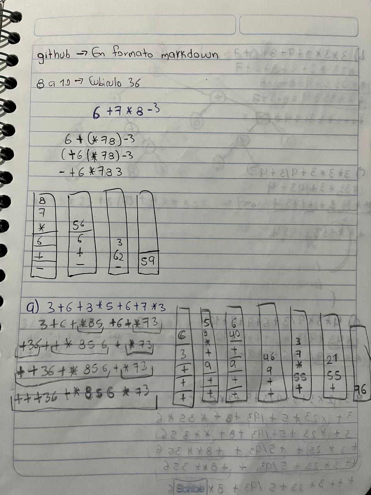
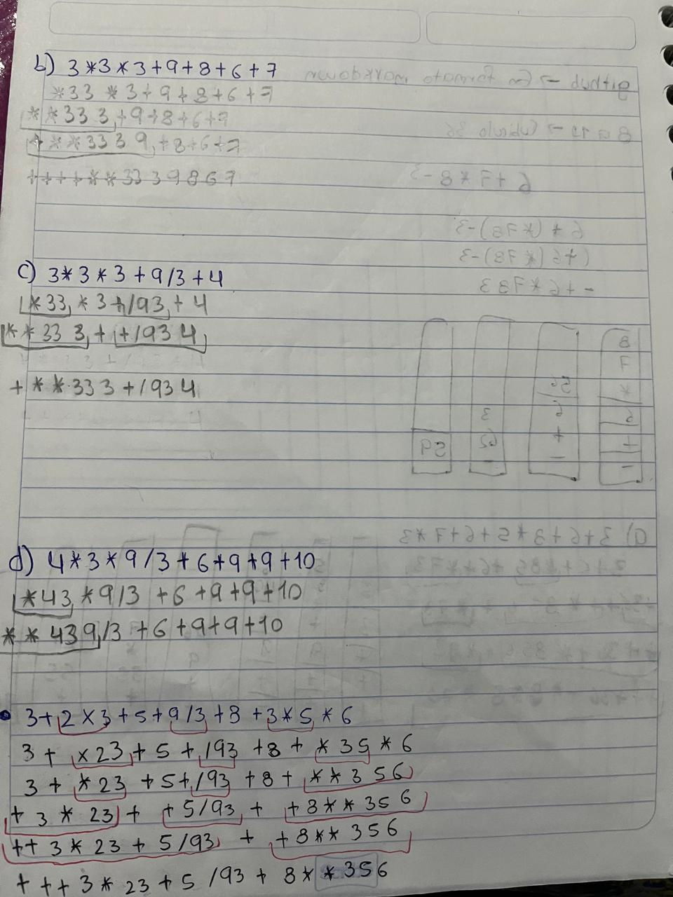
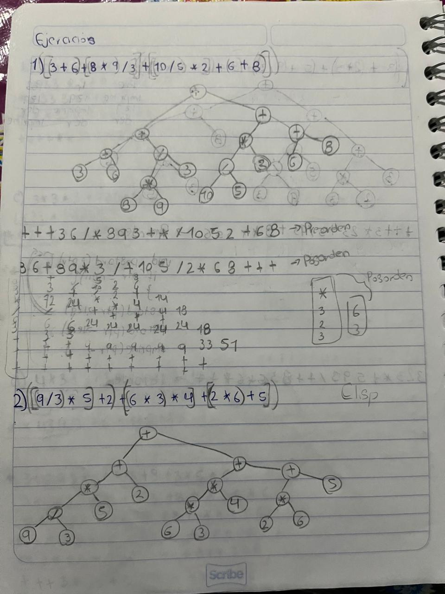
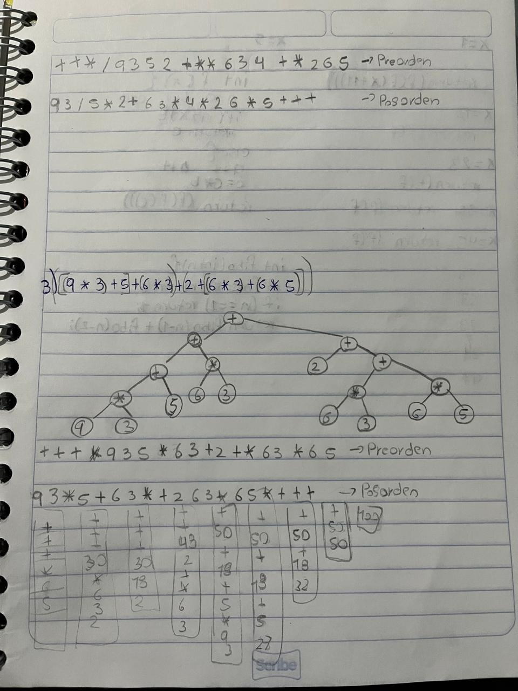

> ### Ejercicios de preorden y postorden con diagramas de arboles

---

---

---

---
> ### Funciones para recorrer una lista y para mostrar solo los numeros pares
La función recorre toma una lista como argumento y la recorre de manera recursiva, imprimiendo cada elemento uno por uno. Utiliza format t "-> ~d" para mostrar el primer elemento de la lista y luego llama a sí misma con cdr lista, que representa el resto de la lista sin el primer elemento.

La función procesar-pares toma una lista y devuelve una nueva lista que contiene únicamente los números pares. Para lograr esto, utiliza remove-if-not junto con evenp, lo que significa que elimina todos los elementos que no son pares y conserva aquellos que cumplen con la condición.
```Lisp
(defun recorre(lista)
    (format t "-> ~d" (car lista))
    (if  lista   
        (recorre (cdr lista))
        )
)

(defun procesar-pares(lista)
    (remove-if-not #'evenp lista)
)
```

> ### Ejercicios con condicionales  
1.- Que calcule el sueldo que le corresponde al trabajador de una
empresa que cobra 40.000 euros anuales, el programa debe realizar los
cálculos en función de los siguientes criterios:
- Si lleva más de 10 años en la empresa se le aplica un aumento del 10%.
- Si lleva menos de 10 años pero más que 5 se le aplica un aumento del
  7%.
- Si lleva menos de 5 años pero más que 3 se le aplica un aumento del
  5%.
- Si lleva menos de 3 años se le aplica un aumento del 3%.()

```Lisp
(defun calcular-sueldo (anios)
  (let ((sueldo-base 40000)
        (incremento 0))
    (cond
      ((> anios 10) (setf incremento 0.10))
      ((> anios 5) (setf incremento 0.07))
      ((> anios 3) (setf incremento 0.05))
      (t (setf incremento 0.03)))
    (* sueldo-base (+ 1 incremento))))
```
2.- Hacer un algortimo que tome el peso en libras de una cantidad de
ropa a lavar en una lavadora y nos devuelva el nivel dependiendo del
peso; además nos informe la cantidad de litros de agua que
necesitamos. Se sabe que con más de 30 libras la lavadora no funcionara
ya que es demasiado peso. Si la ropa pesa 22 ó más libras, el nivel será
de máximo; si pesa 15 ó más nivel será de alto; si pesa 8 ó más será un
nivel medio o de lo contrario el nivel será minimo
```Lisp
(defun nivel-agua (peso)
  (cond
    ((> peso 30) (format t "Demasiado peso. La lavadora no funcionara.~%"))
    ((>= peso 22) (format t "Nivel: Maximo~%Litros de agua: 50~%"))
    ((>= peso 15) (format t "Nivel: Alto~%Litros de agua: 40~%"))
    ((>= peso 8) (format t "Nivel: Medio~%Litros de agua: 30~%"))
    (t (format t "Nivel: Minimo~%Litros de agua: 20~%"))))
````
3.- Martha va a realizar su fiesta de quince años. Por lo cual ha
invitado a una gran cantidad de personas. Pero también ha decidido
algunas reglas: Que todas las personas con edades mayores a los quince
años, sólo pueden entrar si traen regalos; que jóvenes con los quince
años cumplidos entra totalmente gratis pero los de menos de quince años
no pueden entrar a la fiesta. Hacer un algoritmo donde se tome la edad
de una persona y que requisito de los anteriores le toca cumplir si
quiere entrar.

Ejemplo para usar la función:
- (verificar-entrada 14 nil)  ; No puede entrar.
- (verificar-entrada 15 nil)  ; Entra gratis.
- (verificar-entrada 18 t)    ; Entra con regalo.
- (verificar-entrada 18 nil)  ; No entra sin regalo.

```Lisp
(defun verificar-entrada (edad trae-regalo)
  (cond
    ((< edad 15) (format t "No puedes entrar a la fiesta.~%"))
    ((= edad 15) (format t "Entras totalmente gratis~%"))
    ((and (> edad 15) trae-regalo) (format t "Puedes entrar, gracias por traer un regalo.~%"))
    (t (format t "No puedes entrar sin un regalo.~%"))))
```
> ###  Ejercicio con defparameter
Con mapcar recorro la lista *nodos* y aplico la función car a cada sublista para solo mostrar los puros nombres de los videojuegos.

Ejemplo: (mapcar #'car *nodos *)
```Lisp
(defparameter *nodos* 
    '((clashRoyale 
        (principe bandida arquero))
    (superMario 
        (mario luigi peach))
    (pokemon 
        (pikachu charizard bulbasaur))
    (minecraft 
        (steve alex creeper))
    (fortnite 
        (peely raven drift))
    (callOfDuty
        (ghost price soap))
    (halo 
    (masterchief cortana arbiter))
    ))
```